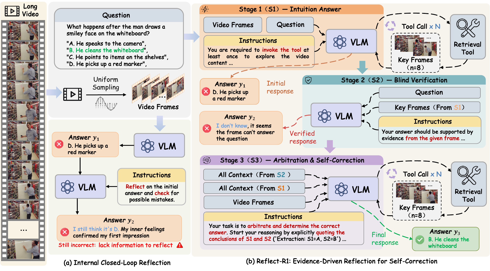

# Reflect-R1: Evidence-Driven Reflection for Self-Correction in Long Video Understanding

*Evidence-driven self-correction for long video understanding with temporal search and stage-decoupled reinforcement learning.*

[📄 [Paper](https://arxiv.org/abs/2606.27922)] [🤗 [Model](https://huggingface.co/CSDDSFSFSAFSAF/Reflect-R1)] [📦 [Dataset](https://huggingface.co/datasets/CSDDSFSFSAFSAF/Reflect-R1-data)] [💻 [Code](https://github.com/ShuimuChen-hyq/Reflect-R1)]

## 📰 News

🔥 **[2026/06/26]** Our [Reflect-R1](https://arxiv.org/abs/2606.27922) paper is available on arXiv.

🔥 **[2026/06/17]** Reflect-R1 is accepted by ECCV 2026.

## 👁️ Overview

Reflect-R1 is an evidence-driven reflection framework for long video understanding. It decomposes self-correction into three stages: intuition, verification, and arbitration. Instead of relying only on closed-loop internal reflection, Reflect-R1 retrieves temporal visual evidence, verifies the initial intuition with independent evidence, and then arbitrates conflicts to produce the final answer.



We further introduce Stage-Decoupled GRPO (SD-GRPO), which computes advantages separately across different reasoning stages. This prevents policy coupling in long multi-stage reasoning and encourages the model to learn genuine correction behavior rather than optimization shortcuts.

## 🚀 Quick Start

### 🏝️ Environmental Setup

**Step 1:** Prepare the running environment.

Install the Python dependencies and expose the local packages:

```bash
pip install -r requirements.txt
pip install -e clip_as_service/client
pip install -e clip_as_service/server

export PYTHONPATH=$PWD:$PWD/clip_as_service/client:$PWD/clip_as_service/server:$PYTHONPATH
```

**Step 2:** Run the temporal evidence server.

Download the pre-trained SigLIP model:

```bash
hf download google/siglip-so400m-patch14-384 --local-dir /path/to/siglip-so400m-patch14-384
```

Start the server:

```bash
export SIGLIP_MODEL_PATH=/path/to/siglip-so400m-patch14-384
export SIGLIP_DEVICE=cuda
export CLIP_PORT=52000

bash scripts/open_source/start_temporal_evidence_server.sh
```

### 📦️ Dataset

The public Reflect-R1 training data is hosted on Hugging Face:

```bash
hf download CSDDSFSFSAFSAF/Reflect-R1-data \
  --repo-type dataset \
  --local-dir /path/to/Reflect-R1-data
```

The dataset repository contains:

```text
data/reflect_r1_cot_90k.jsonl        Reflect-R1-CoT-90k cold-start SFT data
data/reflect_r1_rl_30k_short.json    Reflect-R1-RL-30k short-video split
data/reflect_r1_rl_30k_long.json     Reflect-R1-RL-30k long-video split
archives/short.tar.zst               videos extracted under short/
archives/long.tar.zst                videos extracted under long/
```

Extract the video archives:

```bash
cd /path/to/Reflect-R1-data
tar -I zstd -xf archives/short.tar.zst
tar -I zstd -xf archives/long.tar.zst

export SHORT_VIDEO_DIR=/path/to/Reflect-R1-data/short
export LONG_VIDEO_DIR=/path/to/Reflect-R1-data/long
```

The JSON `video_path` fields are organized with `short/` and `long/` roots. See [docs/training.md](docs/training.md) for local path preparation details.

### 🏗️ Cold-Start SFT

Cold-start SFT teaches the model the structured reflection format. The full run is a multi-node multi-GPU job designed for 2 H200 nodes.

```bash
export MODEL_NAME_OR_PATH=/path/to/Qwen2.5-VL-7B-Instruct
export SFT_DATA_JSONL=/path/to/Reflect-R1-data/data/reflect_r1_cot_90k.jsonl
export SHORT_VIDEO_DIR=/path/to/Reflect-R1-data/short
export LONG_VIDEO_DIR=/path/to/Reflect-R1-data/long
export HOSTFILE=/path/to/mpi_hostfile
export MASTER_ADDR=10.0.0.1

bash scripts/open_source/train_reflect_r1_cold_start_sft.sh
```

### 📋️ SD-GRPO Training

Start the temporal evidence server before launching SD-GRPO:

```bash
export SIGLIP_URL=grpc://127.0.0.1:52000
```

**Step 1:** Run SD-GRPO Stage I for arbitration warm-up.

```bash
export MODEL_NAME_OR_PATH=/path/to/sft-checkpoint
export GRPO_SHORT_JSON=/path/to/Reflect-R1-data/data/reflect_r1_rl_30k_short.json
export GRPO_LONG_JSON=/path/to/Reflect-R1-data/data/reflect_r1_rl_30k_long.json
export SHORT_VIDEO_DIR=/path/to/Reflect-R1-data/short
export LONG_VIDEO_DIR=/path/to/Reflect-R1-data/long

bash scripts/open_source/train_sd_grpo_stage1_arbitration_warmup.sh
```

**Step 2:** Run SD-GRPO Stage II for full-chain optimization.

```bash
export MODEL_NAME_OR_PATH=/path/to/stage1-checkpoint

bash scripts/open_source/train_sd_grpo_stage2_full_chain.sh
```

The open-source launchers use the following reward functions:

```text
Stage I:  v11_valid_tool_split_S3_wandb_no_reasoning_fix
Stage II: v11_valid_tool_split_S123_no_reasoning
```

For more training details and useful overrides, please refer to [docs/training.md](docs/training.md).

## 🔖 Citation

If you find Reflect-R1 useful for your research and applications, please cite using this BibTeX:

```bibtex
@article{chen2026reflectr1,
  title   = {Reflect-R1: Evidence-Driven Reflection for Self-Correction in Long Video Understanding},
  author  = {Shuimu Chen and Yuteng Chen and Yuanshen Guan and Zebang Cheng and Zeyu Zhang and Shengqian Qin and Bin Xia and Jiaran Li and Wenming Yang and Fei Ma},
  journal = {arXiv preprint arXiv:2606.27922},
  year    = {2026}
}
```

## 🎟️ License

This project is released under the [Apache 2.0 license](LICENSE).

## 🏅 Acknowledgements

We thank the authors of the following projects for their contributions:

* [Qwen2.5-VL](https://github.com/QwenLM/Qwen2.5-VL)
* [trl](https://github.com/huggingface/trl)
* [vLLM](https://github.com/vllm-project/vllm)
* [DeepSpeed](https://github.com/microsoft/DeepSpeed)
* [TimeSearch-R](https://github.com/Time-Search/TimeSearch-R)
